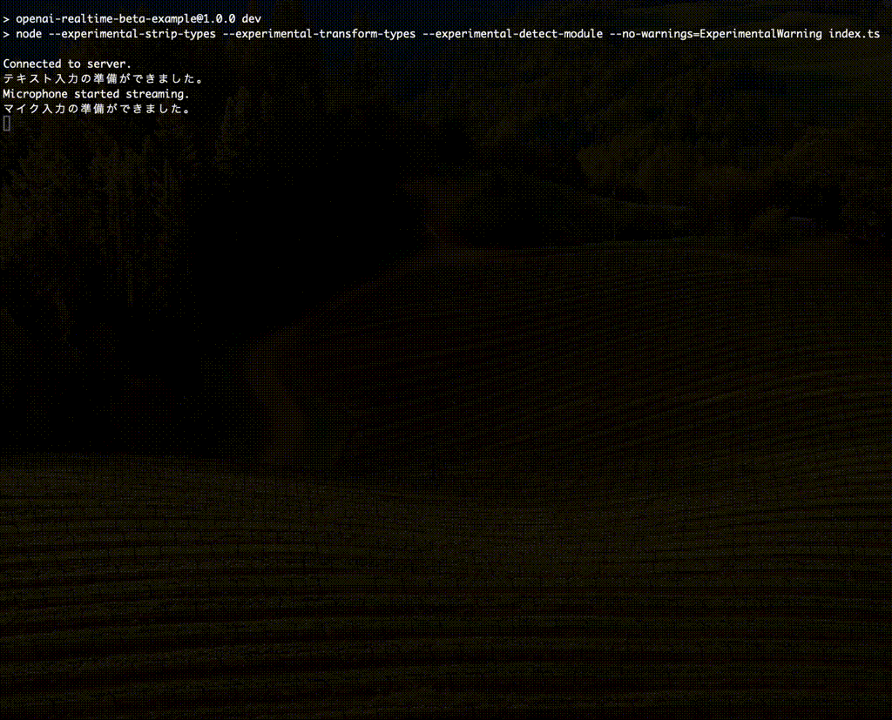

# openai-realtime-beta-example

RealTime API Betaを利用するための OpenAI公式クライアント(https://github.com/openai/openai-realtime-api-beta) を使って音声とテキストで会話します。

[openai-realtime-api-beta の サンプルコード](https://github.com/openai/openai-realtime-api-beta/blob/a5cb94824f625423858ebacb9f769226ca98945f/examples/node_devenv.mjs) を元に作成しました。




## 前提条件

以下の環境を用意する必要があります。

- Node.js 22.7.x以上
    - `--experimental-strip-types`, `--experimental-transform-types --experimental-detect-module` が使えるバージョン
- SOXのインストール (Macの場合は `brew install sox` でインストール)
    - npm モジュール [mic](https://www.npmjs.com/package/mic) を利用しているため
- OpenAI API の APIキー

## 設定

OpenAI APIの APIキーを作成し、環境変数 `OPENAI_API_KEY` を設定する

または、 .envを用意し、 `OPENAI_API_KEY` を設定する

## 起動方法

```
npm run dev
```

マイク、またはテキストで会話できます。
